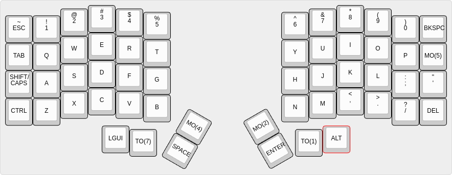

# Iris rev 8 firmware/layout

```
clone repo
press reset button on bottom of keyboard. This will expose the keyboard filesystem. Drag the .uf2 file onto your keyboard.
open vial
load the vil file
```




